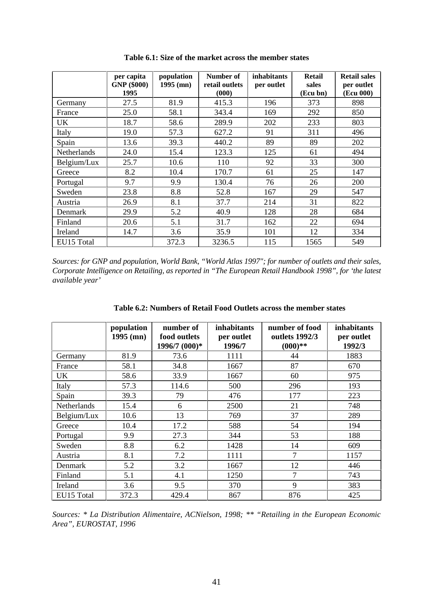
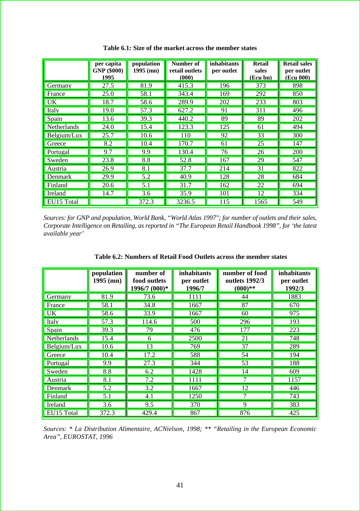

# Table Detection and Extraction from the Forms

It detect all the tables in a form, create bounding boxes around it, segment it out and extract the cells of the tables as well.
  

### Prerequisites

1. OpenCV v3.4 `import cv2`
2. Numpy v1.16 `import numpy as np`
3. OS `import os`
